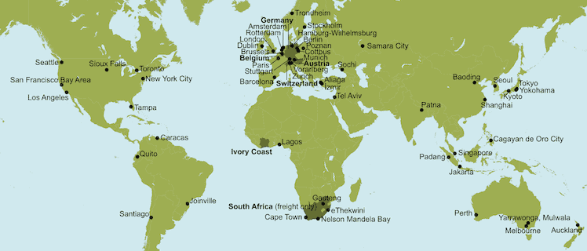

# Scenario Gallery

  MATSim is used all over the world! Have a look how others use MATSim and in what regions they apply it. Learn what data they used and how they prepared their data and processed the output.

  

    <a href="/open-scenario-data"><i class="fa fa-2x fa-files-o pull-left"></i></a>&nbsp;
    Some scenario data is freely available.
    <a href="/open-scenario-data">Have a look!</a>
  

  

Do you have a scenario and want to present it here as well? Feel free to
<a href="mailto:info@matsim.org">contact us</a> so we can add it!

---

