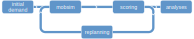

!!! info "MATSim 13.0 released"

    [MATSim 13.0](news/2021-04-12-matsim-13-released/) was released and brings a number of improvements.

Welcome to MATSim

MATSim is an open-source framework for implementing large-scale agent-based transport simulations. **Learn more...**

<video class="hero-video" autoplay muted loop playsinline width=800 height=300>
  <source src="images/hero-video.m4v" type="video/mp4">
</video>

